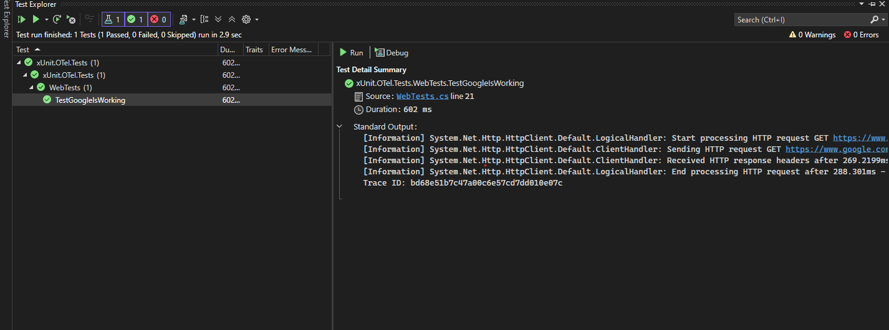

# xUnit.OTel

<p align="center">
  
</p>

[](https://github.com/mrviduus/xUnit.OTel/actions)
[](https://www.nuget.org/packages/xUnit.OTel/)
[](https://www.nuget.org/packages/xUnit.OTel/)
[](https://opensource.org/licenses/MIT)

**🎯 What is this?** A tool that helps you see what your tests are doing, like a camera that records everything happening inside your tests!

**⚠️ Important:** This package only works with xUnit v3!

## 🌟 What Does It Do?

Imagine you're playing with toys and want to know:
- 🎬 When did you start playing?
- ⏱️ How long did you play?
- 🧸 Which toys did you use?
- 📍 What happened step by step?

This tool does the same for your code tests!

**🚀 Key Features:**
- **📺 Built-in Test Output**: All telemetry logs appear directly in your test output by default - no extra setup needed!
- **🔍 HTTP Request Tracing**: See every web call your tests make with timing and response details
- **⚡ Zero Configuration**: Works out of the box with minimal setup
- **🎯 Flexible Tracing**: Trace all tests or just specific ones with attributes

## 📦 Installation

Add it to your project:

```bash
dotnet add package xUnit.OTel
```

## 📺 See Your Tests in Action

**The best part?** All telemetry data appears directly in your test output by default! No need for external dashboards or complex setup - everything you need is right there in your test results.

<p align="center">
  
</p>

As you can see above, HTTP requests, timing information, and trace IDs are automatically logged to your test output, making debugging and understanding your tests incredibly easy!

## 🚀 Quick Start

### Step 1: Add Assembly Trace (Trace ALL tests)
```csharp
// Add this to any test file to trace ALL tests in your project
[assembly: Trace]
[assembly: AssemblyFixture(typeof(TestSetup))]
```

### Step 2: Create TestSetup
See our complete working example in [tests/xUnit.OTel.Tests/TestSetup.cs](tests/xUnit.OTel.Tests/TestSetup.cs)

### Step 3: Write Tests
See our HTTP client testing example in [tests/xUnit.OTel.Tests/WebTests.cs](tests/xUnit.OTel.Tests/WebTests.cs)

**That's it!** Your tests will now show telemetry data in the output.
```

**🎉 Benefits:**
- No need to add `[Trace]` to every test
- All tests in all classes get tracked automatically
- Great for existing projects - just add one line!

### Alternative: Trace Individual Tests

If you want to trace only specific tests, use the `[Trace]` attribute on individual test methods instead of the assembly-level attribute.

**📝 Note:** The `[Trace]` attribute won't work without the `TestSetup` configuration!
```

## Viewing the Data of Tests

The `xUnit.OTel` package, when configured with OTLP exporters as shown in the example below, outputs span data via gRPC to `localhost:4317`. To visualize this telemetry data, you can use the **Aspire Dashboard** which provides a user-friendly interface for viewing traces, metrics, and logs.

### Using Aspire Dashboard with Docker

Run the Aspire Dashboard in a Docker container to view your test telemetry:

```bash
docker run -it -p 18888:18888 -p 4317:18889 -d -e DOTNET_DASHBOARD_UNSECURED_ALLOW_ANONYMOUS=true --name aspire-dashboard mcr.microsoft.com/dotnet/nightly/aspire-dashboard:8.0.0
```

Then navigate to **http://localhost:18888** to access the dashboard.

### Example Configuration

Here's an example of how to configure your tests with the basic OTLP exporters (this sends data to the default `localhost:4317`):

```csharp
public async ValueTask InitializeAsync()
{
    // Create a lightweight application builder without full hosting overhead
    var builder = Microsoft.Extensions.Hosting.Host.CreateApplicationBuilder();

    // Configure the dependency injection container with required services
    builder.Services.AddOTelDiagnostics(
        configureMeterProviderBuilder: m => m.AddOtlpExporter(),
        configureTracerProviderBuilder: t => t.AddOtlpExporter(),
        configureLoggingBuilder: options => options.AddOpenTelemetry(o => o.AddOtlpExporter())
    );

    // Add HttpClient for testing HTTP instrumentation
    // This registers IHttpClientFactory and enables HTTP request tracing
    builder.Services.AddHttpClient();

    // Build the configured host instance
    _host = builder.Build();

    // Start the host to initialize all services and begin background services
    await _host.StartAsync();

    // Log the test run initialization using the configured logging system
    // This demonstrates that the logging integration is working correctly
    var logger = _host.Services.GetRequiredService<ILogger<TestSetup>>();
    logger.LogInformation("OpenTelemetry diagnostics configured with HTTP client instrumentation");
}
```

**Note:** The configuration above uses the default OTLP endpoint (`localhost:4317`). The Docker command maps the dashboard's internal port to a different host port, but your tests will still work with the default configuration.
```

### What You'll See in the Dashboard

The Aspire Dashboard provides several views for your test data:

- **🔍 Traces**: See the complete flow of your test execution, including HTTP calls, database operations, and custom spans
- **📊 Metrics**: View performance metrics and counters from your tests
- **📝 Logs**: Browse structured logs generated during test execution
- **🏗️ Resources**: Monitor the health and status of your test components

## �📊 What Can You See?

When you run a test with tracing enabled, you'll see:

```
🧪 Test: MyFirstTest
├── ⏱️ Started: 10:30:15.123
├── ⏱️ Duration: 245ms
├── ✅ Status: Passed
├── 📍 Class: SimpleTests
└── 📊 Details:
    ├── 🌐 HTTP GET https://www.google.com (125ms)
    ├── 💾 Database Query (50ms)
    └── 🔄 Processing Data (70ms)
```

## 🎨 Real-World Example: Testing a Weather Service

```csharp
using Microsoft.Extensions.DependencyInjection;

namespace xUnit.OTel.Tests;

public class WeatherTests
{
    private readonly HttpClient _httpClient;

    public WeatherTests(TestSetup setup)
    {
        // Get the web caller from our setup
        var factory = setup.Host.Services.GetRequiredService<IHttpClientFactory>();
        _httpClient = factory.CreateClient();
    }

    [Fact]
    public async Task CheckTodaysWeather()
    {
        // Call 1: Get location
        var locationResponse = await _httpClient.GetAsync("https://ipapi.co/json/", TestContext.Current.CancellationToken);
        var location = await locationResponse.Content.ReadAsStringAsync();
        
        // Call 2: Get weather for that location
        var weatherResponse = await _httpClient.GetAsync($"https://wttr.in/London?format=j1", TestContext.Current.CancellationToken);
        
        // The trace will show:
        // - Both HTTP calls
        // - How long each took
        // - What data was sent/received
        // - If anything failed
        
        Assert.True(weatherResponse.IsSuccessStatusCode);
    }
}
```

## 🤔 Common Questions

### "Why do I need a Host?"
Think of the Host as a mini-application that runs during your tests. It's like having a toy kitchen when you want to play cooking - you need the kitchen (Host) to use the stove (HTTP client) and other tools!

The Host is also where the OpenTelemetry system lives - it's like the control room that watches and records everything.

### "What's OpenTelemetry?"
It's like a security camera system for your code. It watches what happens and tells you about it!

### "Do I always need the Collector?"
No! For simple testing, use `AddConsoleExporter()` to see traces right in your test output. The Collector is for when you want to send traces to special monitoring tools like Jaeger or Zipkin.

### "Why doesn't [Trace] work by itself?"
The `[Trace]` attribute is like a light switch - but first you need to install the electrical system (`AddOTelDiagnostics()`)! Without the setup, the switch has nothing to connect to.

### "Should I use [assembly: Trace] or individual [Trace] attributes?"
- Use `[assembly: Trace]` when you want to trace everything (recommended for most projects)
- Use individual `[Trace]` attributes when you only want to trace specific tests

## 📋 Requirements

- .NET 8.0 or later
- xUnit v3 (won't work with xUnit v2!)

## 🆘 Need Help?

- 🐛 [Report Problems](https://github.com/mrviduus/xUnit.OTel/issues)
- 💬 [Ask Questions](https://github.com/mrviduus/xUnit.OTel/discussions)
- 📧 [Email Us](mailto:mrviduus@gmail.com)

## 🎉 Quick Wins

1. **See test duration**: Know which tests are slow
2. **Track HTTP calls**: See all web requests your test makes
3. **Find failures**: Quickly see what went wrong
4. **Understand flow**: See the order of operations

## 📚 More Examples

Check out our [examples folder](https://github.com/mrviduus/xUnit.OTel/tree/main/examples) for:
- Testing with databases
- Testing microservices
- Complex scenarios
- CI/CD integration

## License

This project is licensed under the MIT License - see the [LICENSE](LICENSE) file for details.